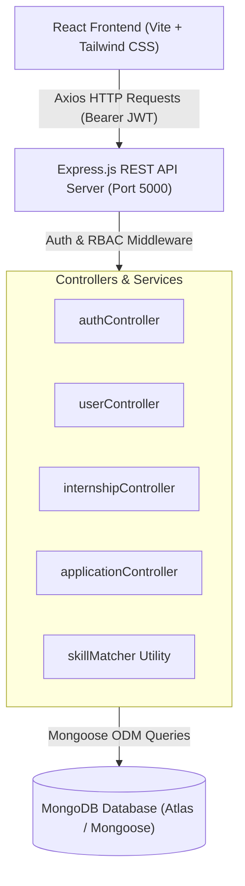

# 🎓 Internship Management System (IMS)

> An intelligent, full-stack web application designed for students to discover internships tailored to their skill profiles, identify and bridge skill gaps, and track applications through a structured recruitment pipeline — while empowering administrators with comprehensive internship management and candidate evaluation tools.

---

## 📌 Problem Statement

Traditional internship job boards present static lists of openings without personalizing recommendations to a candidate's actual competencies. Students frequently:
1. Struggle to determine whether they meet complex job requirements.
2. Suffer from rejection without understanding which specific skills they were missing.
3. Waste time submitting applications to positions where their profile lacks foundational prerequisites.

**Internship Management System** solves this by implementing an algorithmic, transparent **Skill-Based Internship Recommendation and Skill Gap Analysis** engine. It highlights both matched skills and areas for improvement, providing students with actionable career guidance.

---

## ✨ Key Features

### 👨‍🎓 Student Capabilities
- **Secure Authentication**: JWT-based authentication with bcrypt-hashed credentials.
- **Skill & Profile Management**: Maintain education background (college, degree, graduation year) and dynamic technical skill sets stored in MongoDB.
- **Intelligent Skill Matching**:
  - Compares student skills against internship requirements in real-time.
  - Computes exact match percentage: $\frac{\text{Matched Skills}}{\text{Total Required Skills}} \times 100\%$.
  - Highlights **Matched Skills** (`✓`) and **Skills to Improve / Skill Gaps** (`⚠`).
- **Personalized Recommendations**: Automatically ranks and sorts internship openings from highest to lowest compatibility.
- **Internship Search & Filtering**: Multi-parameter search by keyword, technology, and location (e.g., Remote, Bangalore, Mumbai).
- **One-Click Application & Duplicate Prevention**: Apply directly with built-in safeguards preventing duplicate submissions for the same position.
- **Visual Application Progress Tracker**: Track application stages live through a 5-step visual pipeline:
  $$\text{Applied} \longrightarrow \text{Under Review} \longrightarrow \text{Shortlisted} \longrightarrow \text{Interview} \longrightarrow \text{Selected (or Rejected)}$$

### 🛡️ Administrator Capabilities
- **Analytics Dashboard**: Real-time KPI statistics: Total Students, Active Internships, Total Applications, and Placed Students.
- **Full Internship CRUD**: Create, read, edit, and delete internship opportunities with custom skill tags, duration, stipends, and deadlines.
- **Candidate Evaluation**: Inspect student applicant details, academic credentials, and automated candidate skill gap breakdowns.
- **Application Status Management**: Seamlessly transition applicants across recruitment lifecycle stages.

---

## 🧠 Skill Matching Logic

The matching engine uses a clean, transparent, rule-based JavaScript algorithm without relying on opaque machine learning or external AI APIs:

```javascript
// backend/utils/skillMatcher.js
const calculateSkillMatch = (studentSkills = [], requiredSkills = []) => {
  const studentSkillSet = new Set(
    (studentSkills || []).map((s) => s.trim().toLowerCase())
  );

  const matchedSkills = [];
  const missingSkills = [];

  requiredSkills.forEach((skill) => {
    if (studentSkillSet.has(skill.trim().toLowerCase())) {
      matchedSkills.push(skill);
    } else {
      missingSkills.push(skill);
    }
  });

  const matchPercentage = Math.round(
    (matchedSkills.length / requiredSkills.length) * 100
  );

  return { matchPercentage, matchedSkills, missingSkills };
};
```

### Example:
- **Student Skills**: `['Python', 'SQL', 'React']`
- **Internship Required Skills**: `['Python', 'SQL', 'MongoDB', 'Node.js']`
- **Engine Calculation**:
  - Matched: `['Python', 'SQL']` (2)
  - Missing: `['MongoDB', 'Node.js']` (2)
  - Match: **50%**

---

## 🛠️ Technology Stack

| Layer | Technologies |
| :--- | :--- |
| **Frontend** | React 19, Vite, Tailwind CSS v4, React Router v7, Axios, Lucide React Icons |
| **Backend** | Node.js, Express.js, REST APIs, JSON Web Tokens (JWT), Bcrypt.js |
| **Database** | MongoDB Atlas / Local MongoDB, Mongoose ODM |
| **Security** | Dotenv, HTTP Authorization Bearer Tokens, Role-Based Access Control (RBAC), Safe Sanitization |

---

## 🏗️ System Architecture



---

## 📁 Project Folder Structure

```
internship_management_system/
│
├── backend/
│   ├── config/
│   │   └── db.js                 # MongoDB connection logic
│   ├── controllers/
│   │   ├── authController.js     # Register & Login logic
│   │   ├── userController.js     # Profile retrieval & updates
│   │   ├── internshipController.js # CRUD & Recommendations
│   │   └── applicationController.js# Apply, track, stats, & review
│   ├── middleware/
│   │   ├── authMiddleware.js     # JWT token validation
│   │   └── roleMiddleware.js     # Student & Admin RBAC
│   ├── models/
│   │   ├── User.js               # User schema (Student & Admin)
│   │   ├── Internship.js         # Internship posting schema
│   │   └── Application.js        # Application schema
│   ├── routes/
│   │   ├── authRoutes.js         # /api/auth
│   │   ├── userRoutes.js         # /api/users
│   │   ├── internshipRoutes.js   # /api/internships
│   │   └── applicationRoutes.js  # /api/applications
│   ├── utils/
│   │   └── skillMatcher.js       # Rule-based skill match algorithm
│   ├── test-api.js               # Automated backend test suite
│   ├── seed.js                   # Pre-populates sample data
│   ├── .env.example              # Environment variable template
│   ├── .env                      # Local secret configuration (git-ignored)
│   ├── .gitignore                # Excludes node_modules and .env
│   ├── server.js                 # Main Express server entrypoint
│   └── package.json
│
├── frontend/
│   ├── src/
│   │   ├── components/
│   │   │   ├── Navbar.jsx        # Responsive navigation with role links
│   │   │   ├── Footer.jsx        # Footer information
│   │   │   ├── InternshipCard.jsx# Reusable card with skill match badge
│   │   │   ├── SkillMatch.jsx    # Visual match progress & gap analysis
│   │   │   ├── ProtectedRoute.jsx# Role-based route guard
│   │   │   └── Loading.jsx       # Polished loading spinner
│   │   ├── context/
│   │   │   └── AuthContext.jsx   # Global auth state & token persistence
│   │   ├── pages/
│   │   │   ├── Home.jsx          # Hero, highlights, & featured openings
│   │   │   ├── Login.jsx         # Sign-in with quick test credentials
│   │   │   ├── Register.jsx      # Student registration & skill selector
│   │   │   ├── StudentDashboard.jsx # Stats, completion, & top matches
│   │   │   ├── Profile.jsx       # Student profile & skill inventory
│   │   │   ├── Internships.jsx   # Search & filterable internship listing
│   │   │   ├── InternshipDetails.jsx # Detailed view, match & apply
│   │   │   ├── RecommendedInternships.jsx # Ranked recommendations
│   │   │   ├── MyApplications.jsx# Application tracking pipeline
│   │   │   ├── AdminDashboard.jsx# Admin KPIs & recent submissions
│   │   │   ├── ManageInternships.jsx # Admin internship catalog
│   │   │   ├── AddInternship.jsx # Create new internship
│   │   │   ├── EditInternship.jsx# Edit internship details
│   │   │   └── ManageApplications.jsx # Review applications & update status
│   │   ├── services/
│   │   │   └── api.js            # Axios client with interceptors
│   │   ├── App.jsx               # React Router configuration
│   │   ├── main.jsx              # App root mount
│   │   └── index.css             # Tailwind CSS imports & animations
│   ├── .env.example              # Frontend environment template
│   ├── .env                      # Local frontend environment (git-ignored)
│   ├── .gitignore                # Excludes node_modules and .env
│   ├── vite.config.js            # Vite config with Tailwind & proxy
│   └── package.json
│
├── .gitignore                    # Root repository ignore file
└── README.md                     # Comprehensive project documentation
```

---

## ⚙️ Environment Variables Setup

### Backend Configuration (`backend/.env`):
```env
PORT=5000
# For local MongoDB:
MONGO_URI=mongodb://127.0.0.1:27017/internship_management
# For MongoDB Atlas (replace credentials):
# MONGO_URI=mongodb+srv://<username>:<password>@cluster0.mongodb.net/internship_management?retryWrites=true&w=majority
JWT_SECRET=your_super_secret_jwt_key_here
```

### Frontend Configuration (`frontend/.env`):
```env
VITE_API_URL=http://localhost:5000/api
```

*(Both `.env` files are strictly excluded via `.gitignore` to safeguard credentials.)*

---

## 🚀 Installation & Setup Guide

### Prerequisites
- Node.js (v18 or higher)
- npm (v9 or higher)
- MongoDB instance (MongoDB Atlas cluster or local MongoDB service)

### 1. Clone or Open the Repository
```bash
cd d:/internship_management_system
```

### 2. Backend Setup
```bash
cd backend
npm install
```

### 3. Seed Sample Data (Pre-populates Admin, Student, and 6 Internships)
```bash
npm run seed
```

### 4. Frontend Setup
```bash
cd ../frontend
npm install
```

---

## 🖥️ Running the Application

### 1. Start Backend Server
In the `backend/` directory:
```bash
npm start
# Server starts on http://localhost:5000
```

### 2. Start Frontend Development Server
In a separate terminal, inside the `frontend/` directory:
```bash
npm run dev
# Vite server starts on http://localhost:5173 (or next available port)
```

---

## 🧪 Testing Credentials (Pre-seeded)

| Role | Email | Password | Pre-configured Skills |
| :--- | :--- | :--- | :--- |
| **Student** | `student@ims.com` | `student123` | Python, SQL, React, JavaScript, HTML, CSS |
| **Admin** | `admin@ims.com` | `admin123` | Management, Coordination, Review |

*(Quick-fill buttons are conveniently embedded on the Login page for one-click testing.)*

---

## 📡 REST API Reference

### 🔐 Authentication (`/api/auth`)
| Method | Endpoint | Access | Description |
| :--- | :--- | :--- | :--- |
| `POST` | `/api/auth/register` | Public | Register new student account |
| `POST` | `/api/auth/login` | Public | Authenticate user & issue JWT token |

### 👤 User Management (`/api/users`)
| Method | Endpoint | Access | Description |
| :--- | :--- | :--- | :--- |
| `GET` | `/api/users/profile` | Private | Retrieve logged-in profile & skills |
| `PUT` | `/api/users/profile` | Private | Update student details and technical skills |

### 💼 Internships (`/api/internships`)
| Method | Endpoint | Access | Description |
| :--- | :--- | :--- | :--- |
| `GET` | `/api/internships` | Public / Opt | List all internships with search & filters |
| `GET` | `/api/internships/recommended` | Student | Calculate recommendations sorted by match % |
| `GET` | `/api/internships/:id` | Public / Opt | Get details with skill match analysis |
| `POST` | `/api/internships` | Admin | Create a new internship listing |
| `PUT` | `/api/internships/:id` | Admin | Update existing internship listing |
| `DELETE`| `/api/internships/:id` | Admin | Delete internship listing and cascade apps |

### 📝 Applications (`/api/applications`)
| Method | Endpoint | Access | Description |
| :--- | :--- | :--- | :--- |
| `POST` | `/api/applications` | Student | Submit internship application (prevents dupes) |
| `GET` | `/api/applications/my` | Student | List logged-in student's applications |
| `GET` | `/api/applications/stats` | Admin | Dashboard summary metrics & recent apps |
| `GET` | `/api/applications` | Admin | List all applications with status filter |
| `PUT` | `/api/applications/:id/status`| Admin | Update candidate status (e.g. Interview) |

---

## 🔮 Future Enhancements
- **Resume Upload & Parsing**: Automated PDF parsing to extract skills into student profiles.
- **Email Notifications**: Automated transactional alerts when an application advances stages.
- **Company Recruiter Role**: Dedicated third role for external corporate partners to review and post directly.
- **Interview Scheduling Calendar**: Direct interview time-slot selection for shortlisted students.

---

## 📄 License
This project is developed as part of the Full Stack Development (FSD) training program.
